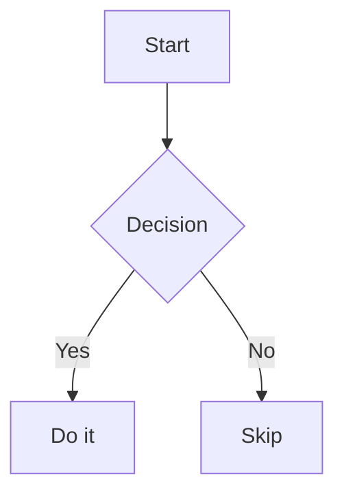

# Nodepad

A privacy-first, local-first personal knowledge management (PKM) app. Write notes in Markdown, store files as plain `.md` files on disk, and extend functionality with plugins.

No account required. No cloud. Everything runs in your browser.

---

## Getting Started

### Install & run

```bash
npm install
npm run dev
```

Open [http://localhost:5173](http://localhost:5173) in your browser.

### Open a vault

A **vault** is a folder on your computer that contains your `.md` files.

1. Click the **folder icon** in the left dock
2. Select any folder on your disk
3. The file tree appears in the sidebar — click any file to open it

---

## Interface Overview

```
┌──────┬────────────────────────────────────────────┐
│ Dock │  Tab bar                                   │
│      ├────────────────────────────────────────────┤
│      │  Breadcrumb (vault / folder / file.md)     │
│      ├────────────────────────────────────────────┤
│      │                                            │
│      │  Editor (CodeMirror 6)                     │
│      │                                            │
│      ├────────────────────────────────────────────┤
│      │  Status bar  (line · col · words)          │
└──────┴────────────────────────────────────────────┘
```

### Left dock (icons top to bottom)

| Icon | Action |
|------|--------|
| Folder | Open/close the file tree sidebar |
| Search | Full-text search across vault |
| Clock | Offline Timeline plugin |
| Tree | Mindmap plugin |
| _(plugin icons)_ | Installed vault plugins |
| Gear | Plugin settings |
| Moon / Sun | Toggle dark / light theme |

---

## Editor Features

### Markdown editing

The editor is [CodeMirror 6](https://codemirror.net/) with full Markdown support — syntax highlighting, auto-pairs, and live formatting.

### Mermaid diagrams

Write a fenced code block with the language `mermaid`:

````

````

- In **reading mode** the raw code is hidden and replaced by the rendered diagram
- **Double-click** the diagram (or hover → click **Edit**) to enter **edit mode**
- In edit mode the raw code is shown with a **live preview** panel below it
- Move the cursor outside the block to return to reading mode
- Right-click the diagram for a context menu

### Auto-save

The file is automatically saved **1 second after you stop typing**. A dot appears on the tab when there are unsaved changes.

### Manual save

`Ctrl + S` (or `Cmd + S` on Mac) saves immediately.

---

## Keyboard Shortcuts

| Shortcut | Action |
|----------|--------|
| `Ctrl + S` | Save current file |
| `Ctrl + P` | Quick switcher — jump to any file by name |

---

## File Tree Sidebar

- **Folders** expand/collapse on click
- **Files** open in a new tab on click
- **New file** button creates a `.md` file in the vault root
- **New folder** button creates a subfolder
- **Tag filter** — click any `#tag` in the sidebar to filter files by frontmatter tag

### YAML frontmatter tags

Add tags to any file using YAML frontmatter at the top:

```markdown
---
tags: [project, work, ideas]
---

# My note
```

Tags appear in the sidebar and can be clicked to filter the file list.

---

## Search

Press **Ctrl + P** or click the search icon to open the quick switcher.

- Type to fuzzy-search across all file names and content in the vault
- Press `Enter` or click a result to open that file

---

## Tabs

- Each opened file gets its own tab
- Click a tab to switch to it
- An **orange dot** on a tab means unsaved changes
- The tab bar scrolls horizontally when many files are open

---

## Plugins

Plugins are loaded automatically. Built-in plugins are always available. You can also drop compiled `.js` plugin files into a `plugins/` folder inside your vault for custom plugins.

### Managing plugins

Click the **gear icon** at the bottom of the dock to open Plugin Settings:

- **Built-in** section — toggle Mermaid Diagrams, Offline Timeline, and Mindmap on or off
- **Vault plugins** section — shows any `.js` files found in your vault's `plugins/` folder
- **Rescan** button — re-reads the vault plugins folder

See individual plugin READMEs for usage details:

- [Mermaid Diagrams](plugins/mermaid-diagrams/README.md)
- [Offline Timeline](plugins/offline-timeline/README.md)
- [Mindmap](plugins/mindmap/README.md)

---

## Tech Stack

| Layer | Choice |
|-------|--------|
| Language | TypeScript (no framework) |
| Build | Vite |
| Editor | CodeMirror 6 |
| File I/O | File System Access API |
| Search | Fuse.js |
| Diagrams | Mermaid.js |
| Mindmap | D3.js |
| Storage | IndexedDB (idb-keyval) |

---

## Build & develop

```bash
npm run dev        # Start dev server
npm run build      # Production build
npm run typecheck  # Type check only
npm run lint       # Lint source files
```
