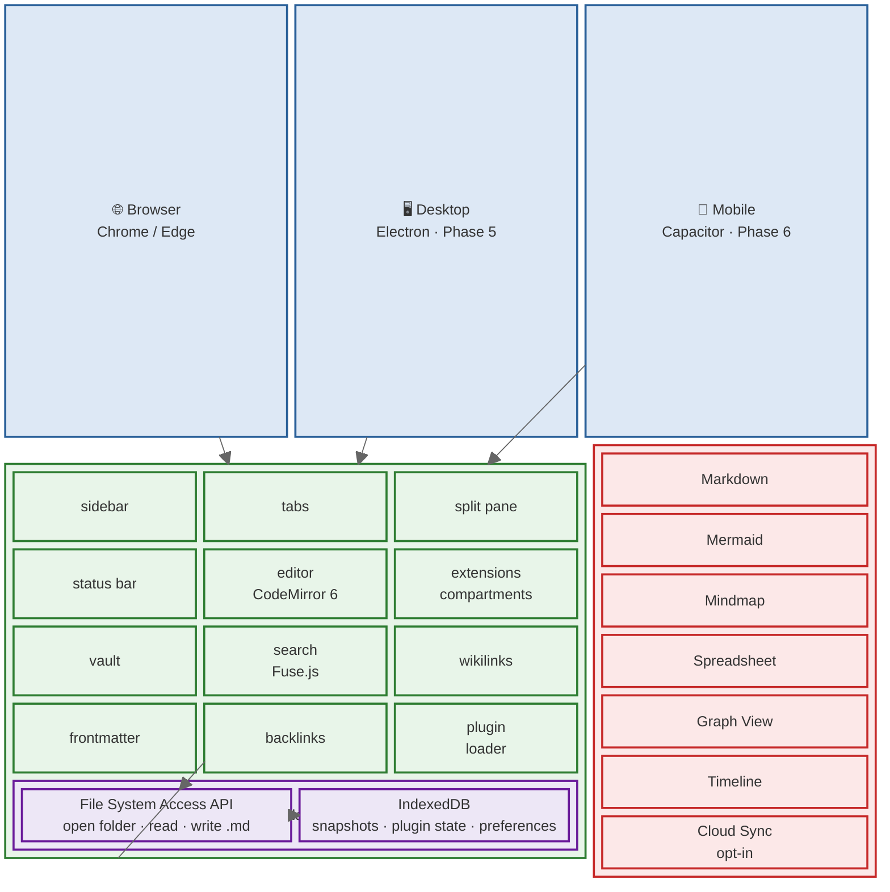

# Nodepad

**A privacy-first, local-first Personal Knowledge Management (PKM) application.**

Nodepad stores notes as plain `.md` files on your own disk, runs entirely in the browser with no server, no account, and no cloud dependency. A plugin architecture lets optional features be loaded, unloaded, and sandboxed at runtime.

---

## Table of Contents

1. [Project Purpose](#1-project-purpose)
2. [Architecture and Ecosystem](#2-️-architecture-and-ecosystem)
3. [Frontend Structure](#3-frontend-structure)
4. [No-Backend Design](#4-no-backend-design)
5. [API Flow](#5-api-flow)
6. [File Structure](#6-file-structure)
7. [Ports Used](#7-ports-used)
8. [Plugin Permission System](#8-plugin-permission-system)
9. [Data Flow & Storage](#9-data-flow--storage)
10. [Deployment](#10-deployment)
11. [Scalability Considerations](#11-scalability-considerations)
12. [Quick Start](#12-quick-start)

---

## 1. Project Purpose

Most note-taking apps store your data on their servers, require accounts, and lock content into proprietary formats. Nodepad takes the opposite approach:

| Principle                | Implementation                                                                                                                                     |
| ------------------------ | -------------------------------------------------------------------------------------------------------------------------------------------------- |
| **Privacy-first**        | All files live on your own disk. Nothing is transmitted anywhere by default.                                                                       |
| **Local-first**          | The app is fully functional without network access. Cloud sync is an opt-in plugin.                                                                |
| **Open format**          | Notes are plain `.md` files. Any text editor can read them without Nodepad.                                                                        |
| **No framework lock-in** | Vanilla TypeScript only — no React, Vue, or Angular. The bundle stays small and the editor stays fast.                                             |
| **Plugin-first**         | Every feature beyond the core editor is a plugin. The core guarantees the plugin contract; plugins can be added, removed, or disabled at any time. |

**Target users:** developers, researchers, students, and writers who want full ownership of their knowledge base.

---

## 2. 🏗️ Architecture and Ecosystem



---

## 3. Frontend Structure

Nodepad has no backend, so every layer is frontend. The codebase is divided into four responsibility zones:

### 3.1 App Shell (`src/app.ts`)

The central hub. Owns:

- Boot sequence (IndexedDB reads → vault reopen → plugin init)
- The concrete implementation of the `App` interface passed to every plugin
- Cross-cutting concerns: theme, global plugin toggle, event bus

### 3.2 Layout (`src/layout/`)

Pure DOM composition. No state. Each class owns one `HTMLElement` subtree.

| Class       | Responsibility                                           |
| ----------- | -------------------------------------------------------- |
| `Sidebar`   | File tree panel + search panel, drag-and-drop reordering |
| `Tabs`      | Tab bar, tab lifecycle, unsaved-change indicator         |
| `Split`     | Resizable left/right pane via pointer-event drag         |
| `StatusBar` | Line/col/word count display, global plugin toggle button |

### 3.3 Editor (`src/editor/`)

Built on **CodeMirror 6** — a modular, composable editor engine.

| File            | Role                                                                                   |
| --------------- | -------------------------------------------------------------------------------------- |
| `index.ts`      | Creates the `EditorView`, wires update listener, exposes `addExtension()`              |
| `extensions.ts` | Baseline extensions: `basicSetup`, markdown language, line-wrapping, theme compartment |
| `markdown.ts`   | WYSIWYG markdown decorations: three separate `ViewPlugin`s (line / mark / replace)     |
| `codeblock.ts`  | Fenced code block widget: `StateField` + `StateEffect`, language label, copy button    |
| `wikilinks.ts`  | `[[wikilink]]` decoration and click-to-navigate                                        |
| `keymaps.ts`    | `Ctrl+S` save, `Ctrl+P` quick switcher                                                 |

Extensions are loaded into **Compartments** so plugins can add and remove them at runtime without rebuilding the entire editor state.

### 3.4 Vault (`src/vault/`)

Manages the open folder and its file graph.

| File             | Role                                                                     |
| ---------------- | ------------------------------------------------------------------------ |
| `index.ts`       | `Vault` class — wraps `FileSystemDirectoryHandle`, read/write, file list |
| `file-tree.ts`   | Recursive directory walker, builds the tree model                        |
| `search.ts`      | Fuse.js index built over all file content; re-indexed on save            |
| `backlinks.ts`   | Scans all files for `[[wikilinks]]`, builds reverse index                |
| `frontmatter.ts` | YAML frontmatter parser: extracts `tags`, `title`, `date`                |

---

## 4. No-Backend Design

Nodepad deliberately has no server-side component for the core app.

```
Traditional PKM app          Nodepad
──────────────────           ──────────────────
Browser ──► Server           Browser only
        ◄── API                  │
Server ──► Database              ▼
                             Local filesystem
                             (File System Access API)
                                 │
                                 ▼
                             IndexedDB
                             (timeline snapshots, prefs)
```

**Consequences:**

| Aspect         | Result                                                              |
| -------------- | ------------------------------------------------------------------- |
| Authentication | Not needed — files are owned by the OS user                         |
| Latency        | Zero (reads/writes are local NVMe/SSD)                              |
| Privacy        | No data ever leaves the machine (without the cloud-sync plugin)     |
| Offline        | 100% functional with no network                                     |
| Deployment     | Serve one HTML file + static assets; no database server, no runtime |

---

## 5. API Flow

### 5.1 File System Access API (FSAA)

The browser's native FSAA is the only I/O mechanism for reading and writing vault files.

```
User clicks "Open Vault"
        │
        ▼
window.showDirectoryPicker()   ← browser permission prompt (once per vault)
        │
        ▼
FileSystemDirectoryHandle      stored in IndexedDB for auto-reopen
        │
        ├─► entries()          recursive tree walk → sidebar file model
        │
        ├─► getFile()          read .md content into editor
        │
        └─► createWritable()   write editor content back to disk
                │              (Ctrl+S or 1-second auto-save debounce)
                ▼
            FileSystemWritableFileStream.write(content)
            FileSystemWritableFileStream.close()
```

### 5.2 Plugin API

Each plugin receives a restricted `App` object — not the real `App` class — constructed by stripping out any methods the plugin did not declare in its `permissions[]` array.

```
Plugin declares permissions: ['editor', 'ui-panels']

PluginLoader reads permissions
        │
        ▼
Builds restricted App proxy:
  ✓ getActiveEditor()
  ✓ addEditorExtension()
  ✓ registerView()
  ✓ addSidebarIcon()
  ✗ readFile()          ← omitted (not declared)
  ✗ writeFile()         ← omitted (not declared)
        │
        ▼
plugin.onLoad(restrictedApp)
```

### 5.3 Editor Extension API

Plugins add CodeMirror extensions via `app.addEditorExtension(ext)`. Internally this reconfigures the editor's extension `Compartment` and returns a cleanup function.

```
plugin.onLoad(app)
  └─► removeExt = app.addEditorExtension([myViewPlugin, myTheme])
                        │
                        ▼
              editor.addExtension(ext)   ← Compartment.reconfigure()
                                         ← view.dispatch({ effects })

plugin.onUnload()
  └─► removeExt()
        │
        ▼
      editor removes the extension from the compartment
      → decorations disappear, editor returns to plain text
```

---

## 6. File Structure

````
nodepad/
│
├── index.html                    Entry point — mounts #app, imports main.ts
├── vite.config.ts                Vite build config
├── tsconfig.json                 TypeScript strict mode
├── package.json
│
├── src/
│   ├── main.ts                   Boots App, attaches to #app
│   ├── app.ts                    App class — central hub, implements App interface
│   │
│   ├── editor/
│   │   ├── index.ts              EditorView factory, addExtension()
│   │   ├── extensions.ts         Baseline CM6 extensions + theme compartment
│   │   ├── markdown.ts           WYSIWYG decorations (3 ViewPlugins)
│   │   ├── codeblock.ts          Fenced code block widget (StateField pattern)
│   │   ├── wikilinks.ts          [[wikilink]] decoration
│   │   └── keymaps.ts            Ctrl+S, Ctrl+P keymaps
│   │
│   ├── layout/
│   │   ├── index.ts              Root layout — dock + sidebar + editor + statusbar
│   │   ├── sidebar.ts            File tree + search panels, drag-and-drop
│   │   ├── tabs.ts               Tab bar + per-tab state
│   │   ├── split.ts              Resizable split pane
│   │   └── statusbar.ts          Status bar, plugin toggle button
│   │
│   ├── vault/
│   │   ├── index.ts              Vault class, FSAA wrapper
│   │   ├── file-tree.ts          Recursive directory walker
│   │   ├── search.ts             Fuse.js full-text search
│   │   ├── backlinks.ts          [[wikilink]] reverse index
│   │   └── frontmatter.ts        YAML frontmatter parser
│   │
│   ├── plugin-api/
│   │   ├── index.ts              Plugin + App interfaces, Permission type
│   │   ├── loader.ts             Dynamic import(), permission proxy builder
│   │   └── registry.ts           Installed plugin list, enable/disable state
│   │
│   ├── styles/                   Per-component CSS (no framework)
│   │
│   └── utils/
│       ├── id.ts                 UUID generation
│       ├── device.ts             Stable device ID (for cloud sync)
│       └── debounce.ts           Debounce / throttle helpers
│
├── plugins/                      Built-in plugins (loaded like vault plugins)
│   ├── markdown/                 WYSIWYG markdown formatting
│   ├── mermaid-diagrams/         ```mermaid``` block → rendered diagram
│   ├── offline-timeline/         Per-save snapshots in IndexedDB
│   ├── mindmap/                  D3.js heading tree
│   ├── graph-view/               D3.js force graph of [[wikilinks]]
│   ├── spreadsheet/              Markdown table → interactive grid
│   └── cloud-sync/               Supabase realtime sync (opt-in)
│
└── example/                      Sample vault — open as a vault in the app
    ├── README.md                 ← this file
    ├── markdown/                 Markdown plugin demo
    ├── mermaid/                  Mermaid plugin demo
    ├── mindmap/                  Mindmap plugin demo
    ├── graphview/                Graph View plugin demo
    ├── spreadsheet/              Spreadsheet plugin demo
    └── timeline/                 Timeline plugin demo
````

---

## 7. Ports Used

| Port     | When                        | Purpose                                                                                       |
| -------- | --------------------------- | --------------------------------------------------------------------------------------------- |
| **5173** | Development (`npm run dev`) | Vite dev server with HMR                                                                      |
| **4173** | Preview (`npm run preview`) | Vite preview of the production build                                                          |
| **—**    | Production                  | Static file serving — any port via any web server (Nginx, Caddy, GitHub Pages, Netlify, etc.) |

No application server port is needed. Production deployment is entirely static.

---

## 8. Plugin Permission System

Plugins declare the subset of the `App` API they need. The loader enforces this at load time by constructing a restricted proxy object.

### Permission table

| Permission    | Unlocked API methods                                                                         |
| ------------- | -------------------------------------------------------------------------------------------- |
| `editor`      | `getActiveEditor()`, `replaceSelection()`, `addEditorExtension()`, `getActiveFile()`         |
| `read-files`  | `readFile()`, `listFiles()`, `getBacklinks()`                                                |
| `write-files` | `writeFile()`                                                                                |
| `ui-panels`   | `registerView()`, `addSidebarIcon()`, `openModal()`                                          |
| `commands`    | `addCommand()`, `addMenuItem()`                                                              |
| `network`     | Permits `fetch()` calls from the plugin (advisory — not technically enforced by the browser) |

### Security model

```
Plugin source (any .js file dropped into vault/plugins/)
        │
        ▼
PluginLoader.load(plugin)
        │
        ├── try { await plugin.onLoad(restrictedApp) }
        │          catch (e) { log error; mark plugin failed; do not crash app }
        │
        └── restrictedApp = only methods matching plugin.permissions[]
                             All other methods are undefined on the object
```

Plugins are isolated by the JavaScript module boundary. They cannot access `src/` internals directly — only the `App` interface. A plugin that crashes is caught and logged; it does not bring down the editor. A plugin that is toggled off has `onUnload()` called, which removes all editor extensions and UI contributions it registered.

---

## 9. Data Flow & Storage

### 9.1 Note lifecycle

```
User types in editor
        │  (debounced 1000ms or Ctrl+S)
        ▼
App.saveActiveFile()
        │
        ├─► vault.writeFile(path, content)
        │         └─► FileSystemWritableFileStream.write()  → disk
        │
        ├─► onFileSave event fires
        │         └─► offline-timeline plugin: write snapshot to IndexedDB
        │         └─► cloud-sync plugin: push snapshot to Supabase (if online)
        │
        └─► vault.search.reindex(path, content)   → Fuse.js index updated
            vault.backlinks.reindex(path, content) → [[link]] index updated
```

### 9.2 IndexedDB schema (idb-keyval)

| Key pattern                      | Value                              | Owner                       |
| -------------------------------- | ---------------------------------- | --------------------------- |
| `vault:handle`                   | `FileSystemDirectoryHandle`        | Core — vault auto-reopen    |
| `plugins:global-enabled`         | `boolean`                          | Core — global plugin toggle |
| `plugin:{id}:enabled`            | `boolean`                          | Plugin registry             |
| `snapshots:{fileId}:{timestamp}` | `{ content, deviceId, timestamp }` | Timeline plugin             |
| `device:id`                      | `string` (UUID)                    | Core utils                  |

### 9.3 Data never leaves the machine unless

1. The **cloud-sync plugin** is installed and the user has configured Supabase credentials.
2. **Images** referenced by URL (``) are fetched by the browser's normal request mechanism.

---

## 10. Deployment

### Development

```bash
npm install
npm run dev        # → http://localhost:5173
```

### Production build

```bash
npm run build      # outputs to dist/
```

`dist/` is a self-contained folder of static files (HTML, JS, CSS, assets). Serve it with any static host:

```
dist/
├── index.html
└── assets/
    ├── index-[hash].js
    └── index-[hash].css
```

### Hosting options

| Platform                | Steps                                                               |
| ----------------------- | ------------------------------------------------------------------- |
| **Nginx**               | `root /srv/nodepad/dist;`                                           |
| **GitHub Pages**        | Push `dist/` to `gh-pages` branch                                   |
| **Netlify / Vercel**    | Connect repo, set build command `npm run build`, publish dir `dist` |
| **Docker**              | `FROM nginx:alpine; COPY dist/ /usr/share/nginx/html/`              |
| **Electron (Phase 5)**  | Wrap `dist/` in an Electron shell for native desktop                |
| **Capacitor (Phase 6)** | Wrap `dist/` in a Capacitor WebView for iOS/Android                 |

**No environment variables, no secrets, no database connection string** is required for the core app. The cloud-sync plugin reads Supabase URL/key from an in-app settings panel; these are stored in `localStorage`, never in the build.

---

## 11. Scalability Considerations

Nodepad is designed for single-user, local operation. "Scale" here means handling large vaults and many plugins gracefully.

### Vault size

| Concern                         | Approach                                                                       |
| ------------------------------- | ------------------------------------------------------------------------------ |
| Large number of files (10 000+) | File tree is built lazily; only expanded folders are walked                    |
| Large file content              | CodeMirror 6 uses a rope data structure — efficient for files up to several MB |
| Search index size               | Fuse.js index is rebuilt incrementally on each save (only the changed file)    |
| Backlink index                  | Built in a single pass on vault open; updated on save (O(1) per save)          |

### Plugin isolation

Each plugin is a separate ES module. Slow or crashing plugins are caught by the `try/catch` wrapper in the loader and do not block the editor. Plugins that add expensive `ViewPlugin` decorations affect only their own render pass.

### Editor performance

CodeMirror 6 virtualises the viewport — only visible lines are decorated. WYSIWYG decorations (markdown, code blocks, mermaid) are computed per-viewport-update, not for the full document. For very long files (50 000+ lines), decorations outside the visible window are skipped.

### Future: Electron desktop

When Electron is added (Phase 5), the `FileSystemAccess API` is replaced by Node.js `fs` — removing the browser's one-time permission prompt per vault and unlocking recursive `fs.watch` for external-change detection.

### Future: Multi-device sync (cloud-sync plugin)

The cloud-sync plugin uses **Supabase Realtime** WebSocket to deliver full-content snapshots to other devices. Conflict resolution is manual (line-by-line review panel). This is intentionally simple — avoiding CRDTs keeps the plugin self-contained and the conflict model auditable.

---

## 12. Quick Start

```bash
# 1. Install dependencies
npm install

# 2. Start the dev server
npm run dev
# → open http://localhost:5173

# 3. Open the example vault
#    Click the folder icon → select the example/ folder in this repo

# 4. Type check
npm run typecheck

# 5. Production build
npm run build
```

### Keyboard shortcuts

| Shortcut   | Action                                    |
| ---------- | ----------------------------------------- |
| `Ctrl + S` | Save current file                         |
| `Ctrl + P` | Quick switcher — jump to any file by name |

### Status bar

The bottom status bar shows **line · column · word count** and a **Plugins ON/OFF** toggle. Turning plugins off strips all WYSIWYG formatting and renders plain text — useful for debugging or raw editing.

---

> **Licence:** MIT
> Built with [CodeMirror 6](https://codemirror.net/), [Vite](https://vitejs.dev/), [D3.js](https://d3js.org/), [Mermaid.js](https://mermaid.js.org/), [Fuse.js](https://fusejs.io/)
