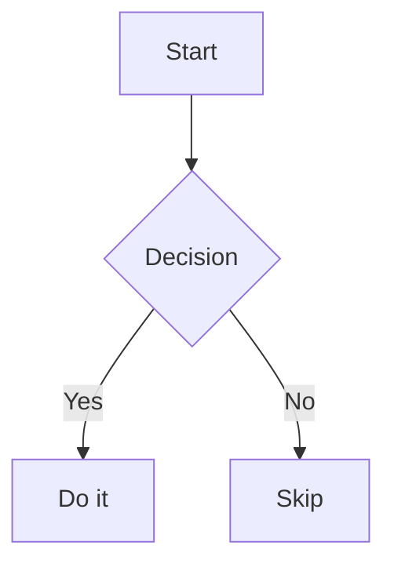

# Nodepad

A privacy-first, local-first personal knowledge management (PKM) app. Write notes in Markdown, store files as plain `.md` files on disk, and extend functionality with plugins.

No account required. No cloud. Everything runs in your browser.

---

## Getting Started

### Install & run

```bash
npm install
npm run dev
```

Open [http://localhost:5173](http://localhost:5173) in your browser.

### Open a vault

A **vault** is a folder on your computer that contains your `.md` files.

1. Click the **folder icon** in the left dock
2. Select any folder on your disk
3. The file tree appears in the sidebar — click any file to open it

Your vault folder is remembered across sessions, so it reopens automatically next time.

---

## Interface Overview

```
┌──────┬─────────────────────────────────────────────┐
│ Dock │  Sidebar (file tree / search)               │
│      ├─────────────────────────────────────────────┤
│      │  Tab bar                                    │
│      ├─────────────────────────────────────────────┤
│      │  Breadcrumb (vault / folder / file.md)      │
│      │                                             │
│      │  Editor (CodeMirror 6)                      │
│      │                                             │
│      ├─────────────────────────────────────────────┤
│      │  Status bar  (line · col · words)           │
└──────┴─────────────────────────────────────────────┘
```

### Left dock (icons, top to bottom)

| Icon | Action |
|------|--------|
| Folder | Toggle file tree sidebar |
| Search | Full-text search across vault |
| _(plugin icons)_ | Graph View, and any installed vault plugins |
| Gear | Plugin settings |
| Moon / Sun | Toggle dark / light theme |

---

## Editor

### Markdown editing

The editor is [CodeMirror 6](https://codemirror.net/) with full Markdown support — syntax highlighting, auto-pairs, and live formatting.

### Mermaid diagrams

Write a fenced code block with the language `mermaid`:

````

````

- In **reading mode** the raw code is hidden and replaced by the rendered diagram
- **Double-click** the diagram to enter **edit mode**
- In edit mode a **live preview** panel appears below the code
- Move the cursor outside the block to return to reading mode

### Auto-save

The file is automatically saved **1 second after you stop typing**. A dot appears on the tab when there are unsaved changes.

### Manual save

`Ctrl + S` (or `Cmd + S` on Mac) saves immediately.

---

## Keyboard Shortcuts

| Shortcut | Action |
|----------|--------|
| `Ctrl + S` | Save current file |
| `Ctrl + P` | Quick switcher — jump to any file by name |

---

## File Tree Sidebar

- **Folders** expand/collapse on click
- **Files** open in a new tab on click
- **New file** button (toolbar) — creates a file in the same folder as the currently open file; falls back to vault root if nothing is open
- **New folder** button (toolbar) — creates a folder next to the currently open file
- **Tag filter** — click any `#tag` in the sidebar to filter files by frontmatter tag

### Right-click context menu (files)

| Action | Description |
|--------|-------------|
| Rename | Inline rename — press Enter to confirm, Escape to cancel |
| Delete | Permanently removes the file (with confirmation) |
| Copy Path | Copies the vault-relative path to clipboard |
| Select for Compare | Marks this file as the compare source |
| Compare with "X" | Opens a diff view between two selected files |

### Right-click context menu (folders)

| Action | Description |
|--------|-------------|
| New File Here | Creates a new `.md` file inside this folder |
| New Folder Here | Creates a subfolder inside this folder |
| Rename | Inline rename of the folder |
| Delete Folder | Recursively removes the folder (with confirmation) |

### YAML frontmatter tags

Add tags to any file using YAML frontmatter at the top:

```markdown
---
tags: [project, work, ideas]
---

# My note
```

Tags appear at the bottom of the sidebar as clickable pills that filter the file list.

---

## File Diff View

Right-click two files and use **Select for Compare** / **Compare with "X"** to open a side-by-side diff modal showing added and removed lines.

The diff view also appears when clicking a snapshot in the Timeline plugin — with a **Restore** button to write that version back to disk.

---

## Tabs

- Each opened file gets its own tab
- Click a tab to switch to it
- An **orange dot** on a tab means unsaved changes
- The tab bar scrolls horizontally when many files are open

---

## Search

Press **Ctrl + P** or click the search icon in the dock to open the quick switcher.

- Type to fuzzy-search across all file names and content in the vault
- Press `Enter` or click a result to open that file

---

## Plugins

Plugins extend the app with additional features. Built-in plugins are always available. You can also drop compiled `.js` plugin files into a `plugins/` folder inside your vault for custom plugins.

### Built-in plugins

| Plugin | Description |
|--------|-------------|
| [Mermaid Diagrams](plugins/mermaid-diagrams/README.md) | Renders `mermaid` code blocks as interactive diagrams |
| [Offline Timeline](plugins/offline-timeline/README.md) | Saves a snapshot on every save; browse and restore past versions |
| [Mindmap](plugins/mindmap/README.md) | Visualises heading structure as a D3.js tree |
| [Graph View](plugins/graph-view/README.md) | Force-directed graph of all `[[wikilink]]` connections across the vault |

### Managing plugins

Click the **gear icon** at the bottom of the dock to open Plugin Settings:

- **Built-in** section — toggle each built-in plugin on or off
- **Vault plugins** section — shows any `.js` files found in your vault's `plugins/` folder
- **Rescan** button — re-reads the vault plugins folder

---

## Tech Stack

| Layer | Choice |
|-------|--------|
| Language | TypeScript (no framework) |
| Build | Vite |
| Editor | CodeMirror 6 |
| File I/O | File System Access API |
| Search | Fuse.js |
| Diagrams | Mermaid.js |
| Graph / Mindmap | D3.js |
| Storage | IndexedDB (idb-keyval) |

---

## Build & develop

```bash
npm run dev        # Start dev server
npm run build      # Production build
npm run typecheck  # Type check only
npm run lint       # Lint source files
```
