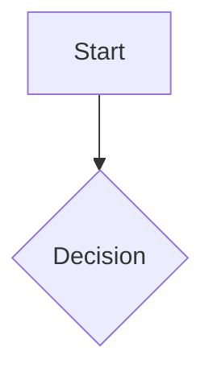

# Mermaid Diagrams Plugin

Renders Mermaid diagrams inline in the editor. Raw code is hidden in reading mode and replaced by the rendered SVG diagram.

---

## How it works

Write a fenced code block tagged with `mermaid`:

- **Reading mode** — cursor outside the block → diagram is rendered, code is hidden
- **Edit mode** — cursor inside the block → code is editable, live preview appears below

---

## Controls

| Action | Result |
|--------|--------|
| Double-click diagram | Enter edit mode |
| Hover diagram | Show toolbar (Edit / Copy SVG) |
| Move cursor out | Return to reading mode |

---

## Example files

- [[mermaid/example|Diagram showcase]] — all major diagram types

---

## Permissions

This plugin requires no special permissions — it operates entirely within the editor.
