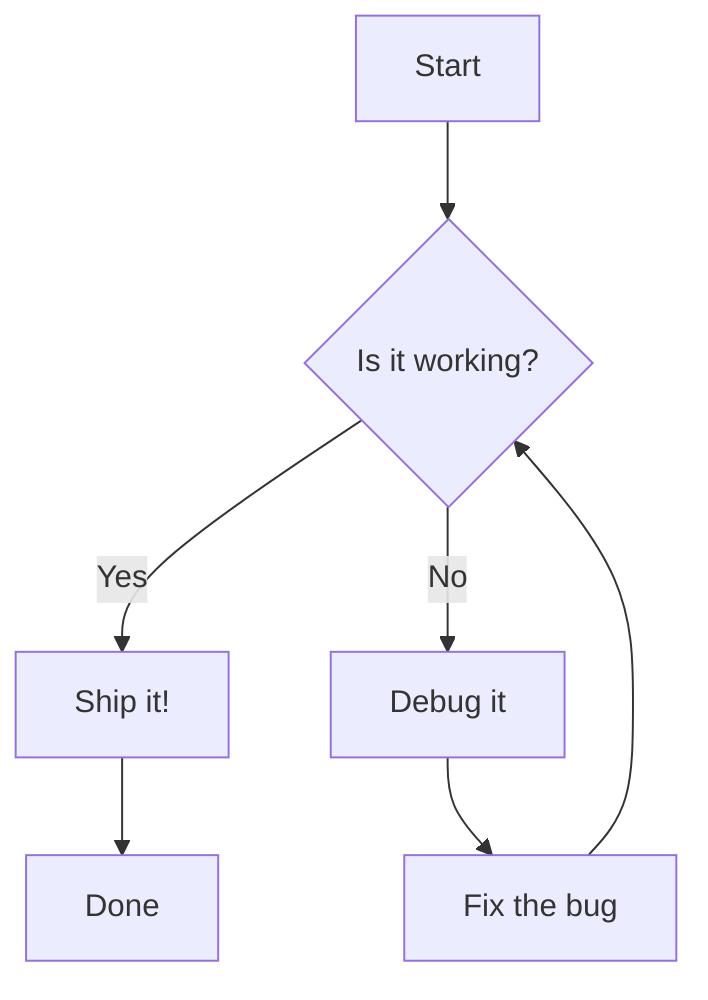
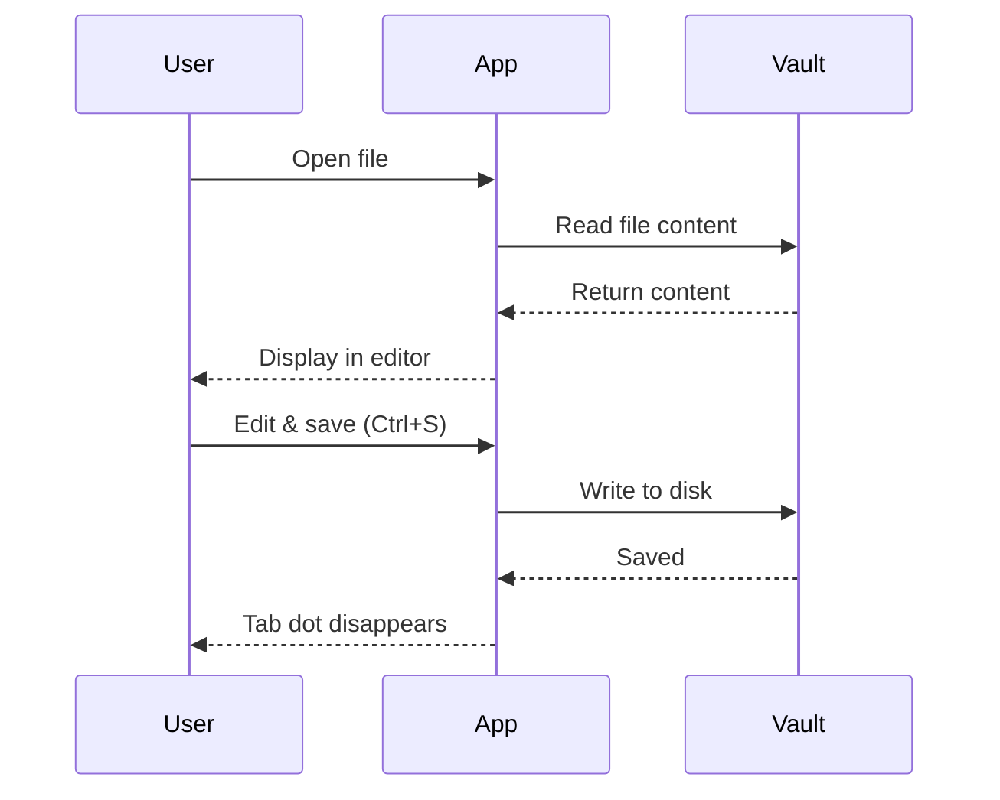
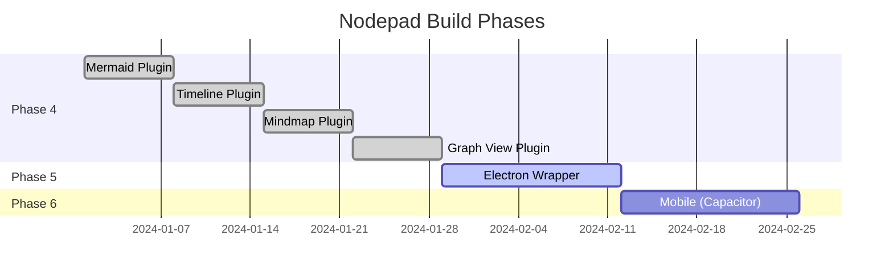
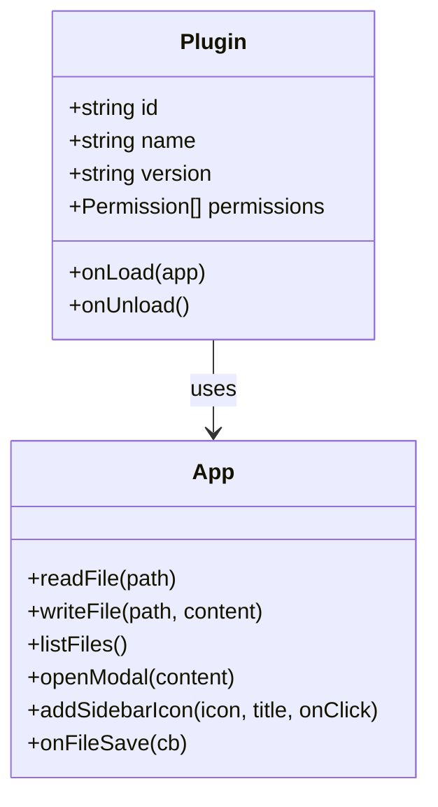
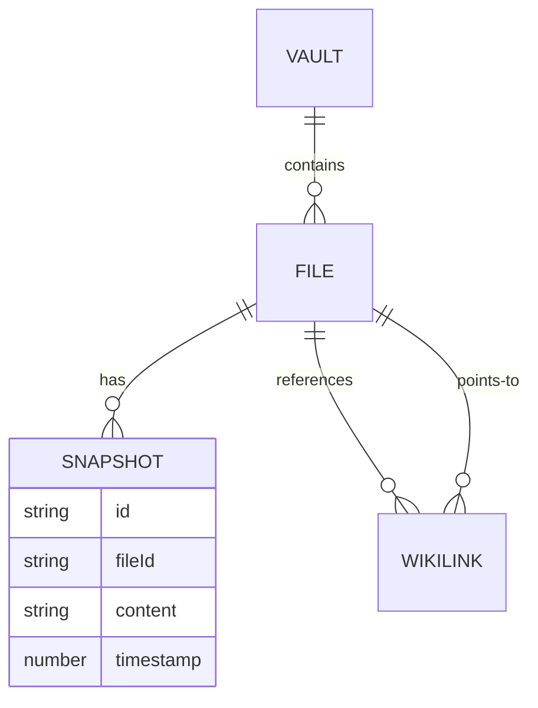
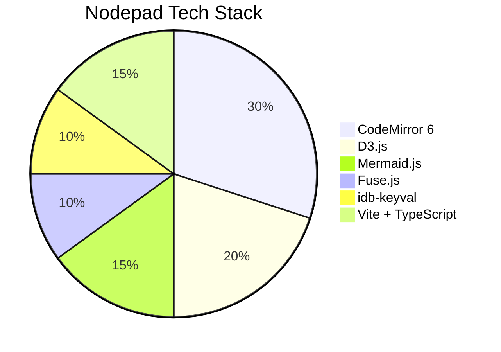

# Mermaid Diagrams — Examples

Open this file and try **double-clicking** any diagram below to enter edit mode. Move the cursor out to return to reading mode.

---

## Flowchart

---

## Sequence Diagram

---

## Gantt Chart

---

## Class Diagram

---

## Entity Relationship

---

## Pie Chart

