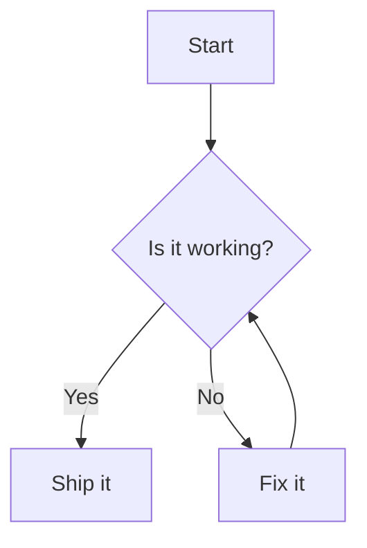
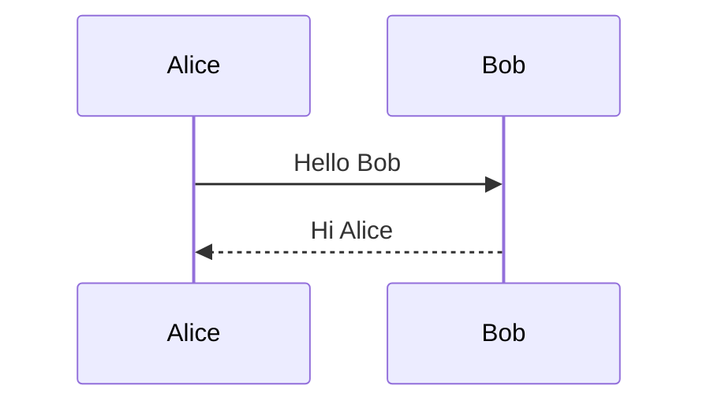
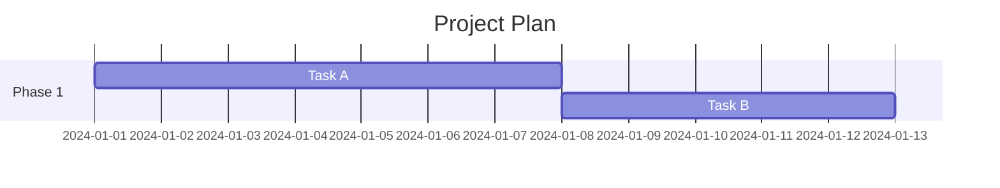
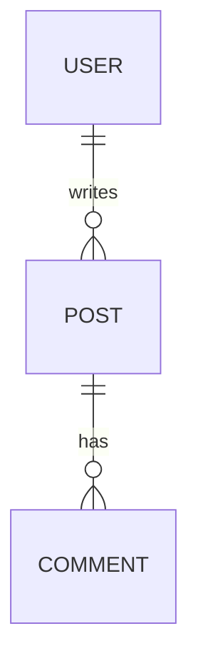
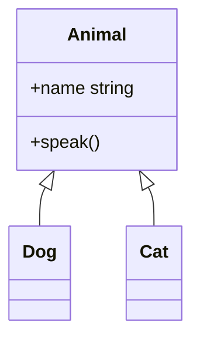

# Mermaid Diagrams Plugin

Renders [Mermaid](https://mermaid.js.org/) diagrams inline in the editor. Raw code is hidden in reading mode and replaced by the rendered SVG diagram.

---

## How it works

The plugin watches for fenced code blocks tagged with `mermaid`:

````
```mermaid
<your diagram code here>
```
````

It has two modes — **reading** and **edit** — that switch automatically based on where your cursor is.

---

## Reading mode (default)

When your cursor is **outside** a mermaid block, the raw code is hidden and replaced by the rendered diagram.

- **Double-click** the diagram to enter edit mode
- **Hover** over the diagram to reveal the toolbar (top-right corner)

### Toolbar buttons

| Button | Action |
|--------|--------|
| Edit | Enter edit mode for this block |
| Copy SVG | Copy the raw SVG markup to clipboard |

### Right-click context menu

Right-click any diagram to open a context menu with:

- **Edit diagram** — same as double-clicking

---

## Edit mode

When your cursor is **inside** a mermaid block, the raw code becomes editable and a **Live Preview** panel appears directly below the code block.

- The preview updates as you type (debounced 300 ms)
- Click the **× button** in the preview header to exit edit mode
- Moving the cursor **outside** the block also exits edit mode

---

## Diagram types

Any diagram type supported by Mermaid works. Common examples:

### Flowchart

````

````

### Sequence diagram

````

````

### Gantt chart

````

````

### Entity relationship

````

````

### Class diagram

````

````

---

## Theme

The diagram theme follows the app theme automatically:

- **Dark theme** → Mermaid `dark` theme
- **Light theme** → Mermaid `default` theme

---

## Permissions

This plugin requires no special permissions — it operates entirely within the editor view layer.
